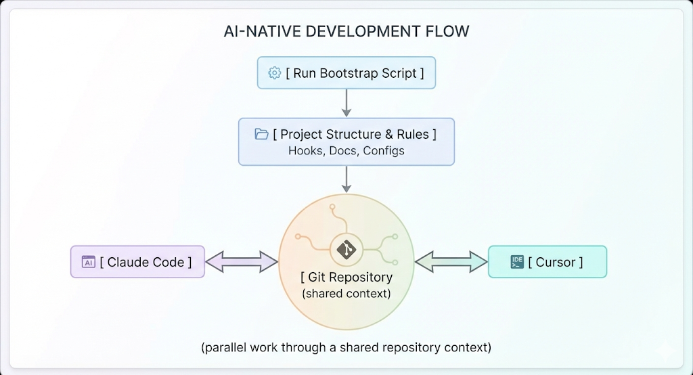

# Claude-Cursor-Context-Combiner

A lightweight framework for working with **Claude Code** and **Cursor** in parallel,\
using Repomix-based context snapshots to maintain a shared and consistent project context.

Claude Code and Cursor are used as a reference setup; however, the workflow itself is agent- and IDE-agnostic.

**Documentation**
- [Usage instructions](Docs/docs_usage_instructions.md)
- [Bootstrap script breakdown](Docs/docs_bootstrap_script_breakdown.md)
- [Claude client compatibility](Docs/docs_claude_client_compatibility.md)

**Script**
- `bootstrap.js` — Main entry point. Copy to your project root, then run `node bootstrap.js init`.

---

## Quick start

**Prerequisites:** Node.js and Git. Optional: Claude Desktop or Cursor for MCP auto-setup (`--setup-mcp`). The workflow is not tied to a specific Claude UI — which clients work (Desktop, CLI, VS Code) and how MCP applies: [Claude client compatibility](Docs/docs_claude_client_compatibility.md).

1. Place `bootstrap.js` in the **root of the project** you want to use as the shared context (copy it from this repo or download it).
2. From that folder run:
   - **First-time setup:** `node bootstrap.js init`
   - **With Claude Desktop MCP:** `node bootstrap.js init --setup-mcp` (recommended if you use Claude Desktop).
   - **Overwrite existing hooks/scripts:** `node bootstrap.js init --force` (creates a backup first).
3. Verify setup: `node bootstrap.js check`  
   Show usage and options: `node bootstrap.js --help`

For full workflow and all commands, see [Usage instructions](Docs/docs_usage_instructions.md).

---

## Workflow overview

1. Run the bootstrap script
2. Project structure and rules are created
3. Repository becomes the shared context
4. Claude Code and Cursor work in parallel
5. Context is preserved through git commits and diffs. The bootstrap script enforces a commit message policy and, after each commit, regenerates a repository snapshot (`.mcp/context.xml`) so tools can stay aligned without relying on chat history.

### Visual flow (conceptual)

---

## Introduction

I work with multiple LLM-based tools and agents in parallel.

A recurring problem is context alignment:\
each tool requires time to be brought up to speed, and even then often interprets the project differently.\
This leads to context drift, repeated explanations, and accumulating errors.

I wanted to improve how tools stay aligned with the actual state of a project,\
using git history, git diffs, and meaningful commits as a shared source of context.

This repository documents a workflow I’ve been testing in practice.\
Feel free to experiment with it, suggest improvements,\
and propose ways to extend this approach to other tools.

---

## What problem does this solve?

Modern AI-assisted development tools work well individually,\
but tend to break down when used together.

Each tool:

- builds its own partial understanding of the project
- loses context between sessions
- makes decisions in isolation

As a result:

- context drifts
- decisions are repeated
- changes become inconsistent

This framework exists to **hold the project context together**.

---

## Core idea

You don’t coordinate tools manually.\
The **repository becomes the shared context**.

- The repo is the source of truth
- Context is rebuilt from the project itself
- Tools operate in parallel, not sequentially
- No tool owns the system — the system owns the tools

---

## What this is

- A conceptual framework for multi-tool workflows
- A way to combine strengths of different AI-assisted development tools
- A structure for context continuity across sessions and agents
- A process-first approach, not a coding shortcut

---

## What this is NOT

- Not a no-code platform
- Not a prompt collection
- Not a replacement for understanding your system
- Not tied to a single AI model or vendor

---

## Who is this for?

- People coordinating multiple AI-assisted development tools
- System thinkers and product builders
- Developers frustrated by context loss between tools

---

## Design principles

- Context over chat history
- Repository over prompts
- Process over automation
- Determinism over magic

---

## Current status

This is an early-stage project.

The goal is to document and evolve a clear, repeatable process\
for combining multiple development tools without losing context.

Setup: run the bootstrap script from your project root (see [Quick start](#quick-start)). For step-by-step workflow and technical breakdown, see [Usage instructions](Docs/docs_usage_instructions.md) and [Bootstrap script breakdown](Docs/docs_bootstrap_script_breakdown.md).

---

## Philosophy

You define the system.\
Tools execute.

---

## Foundations & references

This workflow builds on existing open-source tools and ideas, combined into a single, opinionated process focused on context preservation.

- **Repomix**\
  Used as the basis for deterministic repository snapshots and structured context packaging.\
  [https://github.com/yamadashy/repomix](https://github.com/yamadashy/repomix)

- **Serena** (optional)\
  Used as a reference for on-demand context expansion and semantic indexing.\
  [https://github.com/oraios/serena](https://github.com/oraios/serena)

The contribution of this project is the process design: how these components are composed to support parallel tool usage without context drift.

---

## License

MIT License

Copyright (c) 2026

Permission is hereby granted, free of charge, to any person obtaining a copy of this software and associated documentation files (the "Software"), to deal in the Software without restriction, including without limitation the rights to use, copy, modify, merge, publish, distribute, sublicense, and/or sell copies of the Software, and to permit persons to whom the Software is furnished to do so.

THE SOFTWARE IS PROVIDED "AS IS", WITHOUT WARRANTY OF ANY KIND, EXPRESS OR IMPLIED, INCLUDING BUT NOT LIMITED TO THE WARRANTIES OF MERCHANTABILITY, FITNESS FOR A PARTICULAR PURPOSE AND NONINFRINGEMENT.
